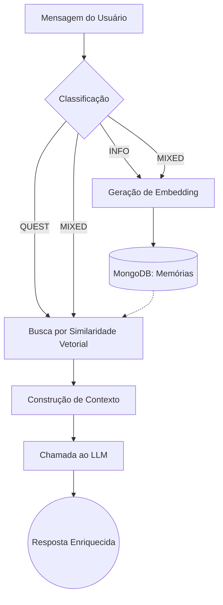

# 🧠 NeuroCache


Sistema de memória semântica contextual para LLMs, com autenticação segura e recuperação vetorial personalizada por usuário.

## 📌 Visão Geral

O **NeuroCache** é uma aplicação backend que implementa um sistema de memória semântica persistente por usuário, integrado a modelos de linguagem (LLMs). O sistema transforma conversas em memória estruturada, permitindo que respostas futuras sejam enriquecidas com contexto histórico relevante.

Na prática, trata-se de uma implementação robusta de **RAG (Retrieval-Augmented Generation)** construída do zero, totalmente personalizada por usuário, funcionando como uma camada de memória cognitiva artificial.

---

## 🚀 O Pipeline Principal

Cada usuário possui um conjunto de memórias isoladas e armazenadas semanticamente. Ao receber uma nova mensagem, o sistema executa o seguinte fluxo cognitivo:



---


🧩 Funcionalidades Core
🔐 Autenticação e Segurança (Stateless)

    Autenticação via JWT (JSON Web Token).

    Implementação baseada no Spring Security 6.

    Controle de acesso baseado em Roles com UserDetails customizado.

    Senhas fortemente criptografadas com BCrypt.

    Interceptação segura de requisições via Filtro JWT personalizado.

### 🧠 Classificação de Contexto Cognitivo

As mensagens enviadas pelos usuários passam por uma etapa de extração estruturada e são classificadas em três tipos para otimização do fluxo:

| Tipo | Descrição | Comportamento do Sistema |
|---|---|---|
| **INFO** | Informação declarativa. | Armazenada silenciosamente como nova memória. |
| **QUEST** | Pergunta direta do usuário. | Dispara a recuperação de contexto vetorial. |
| **MIXED** | Informação + Pergunta. | Armazena a nova informação e recupera contexto para responder. |

### 📚 Sistema de Memória Vetorial

As memórias são isoladas por usuário e persistidas em banco de dados NoSQL, indexadas para buscas matemáticas.

```java
public class Memory {
    private String id;
    private String userId;
    private Domain domain;
    private String content;
    private float[] embedding; // Representação vetorial do conteúdo
    private double confidence; // Nível de confiança da informação
    private Instant createdAt;
}
```

🔎 Recuperação (RAG) e Similaridade

```
Ao processar uma pergunta (QUEST ou MIXED):

    Gera-se o embedding vetorial da pergunta.

    O sistema recupera as memórias do usuário no MongoDB.

    Calcula-se a similaridade de cosseno entre a pergunta e as memórias.

    As memórias são filtradas por similaridade + índice de confiança.

    As memórias aprovadas são injetadas dinamicamente no prompt do modelo.
```

🏗 Arquitetura e Organização

```
A aplicação segue conceitos de Clean Architecture, organizada de forma modular e extensível:

    controllers/: Exposição das APIs REST.

    services/: Regras de negócio isoladas.

    repositories/: Interfaces do Spring Data MongoDB.

    entities/ & dtos/: Modelagem de dados e transferência.

    configs/ & exceptions/: Configurações de Beans e tratamento global de erros.
```


🛠 Tecnologias Utilizadas

    Linguagem & Framework: Java 17+, Spring Boot 3

    Segurança: Spring Security 6, JWT, BCrypt

    Banco de Dados: MongoDB (Spring Data MongoDB)

    Inteligência Artificial: Spring AI, Ollama (LLM Local)

    Utilitários: Lombok, ModelMapper, OpenFeign

🧬 Exemplo Prático de Funcionamento

Entrada do Usuário:

    "Eu sou muito disciplinado. Como posso melhorar ainda mais?"

Processamento (NeuroCache):

    Classificação: O sistema identifica como MIXED.

    Armazenamento: A frase "Eu sou muito disciplinado" é convertida em embedding e salva na base do usuário.

    Recuperação: A pergunta "Como posso melhorar ainda mais?" busca na base outras memórias (ex: o usuário já mencionou que estuda Java e acorda às 6h).

    Construção: O prompt é montado com a pergunta + o histórico recuperado.

    Geração: O LLM gera uma resposta altamente personalizada usando o contexto injetado.

🎯 Objetivos do Projeto
```
Este projeto foi desenvolvido para demonstrar a aplicação de engenharia de software na construção de sistemas inteligentes. Os principais pilares técnicos demonstrados aqui incluem:

    Arquitetura backend segura e escalável.

    Implementação manual e customizada do padrão RAG.

    Pesquisa vetorial e cálculo de similaridade semântica.

    Engenharia avançada de prompts e extração estruturada de dados com IA.

    Modelagem de um contexto cognitivo artificial utilizando ecossistema Spring.

```
---
